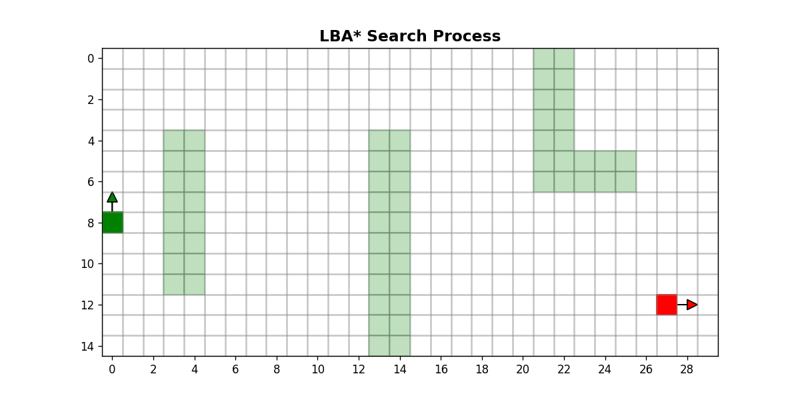

# MeshA\*: Efficient Path Planning With Motion Primitives

[](https://opensource.org/licenses/MIT)
[](https://aaai.org/)
[](https://isocpp.org/)
[](https://www.python.org/)
[](https://jupyter.org/)

This repository contains the official implementation of **MeshA\***, a kinodynamic path planning algorithm presented at the **AAAI Conference on Artificial Intelligence (2026)**.

MeshA* solves path planning problems with differential constraints using a finite set of motion primitives. Unlike conventional **Lattice-Based A\* (LBA\*)**, which searches directly over the state lattice, MeshA* operates on **Extended Cells**. This abstraction allows the algorithm to perform early pruning of unpromising trajectory bundles while guaranteeing both completeness and solution optimality. Empirically, MeshA* reduces runtime by **1.5–2x** compared to state-of-the-art baselines in cluttered environments.


## 🔍 Visual Comparison

The following animations demonstrate the qualitative difference in state-space exploration between the baseline and the proposed method.

* **LBA\*** (Left): Exhibits a high branching factor, explicitly expanding full bundles of primitives at every visited state.
* **MeshA\*** (Right): Propagates as a wavefront across grid cells. The blue primitive bundles shown at Initial Extended Cells are visualized to illustrate the kinematic constraints guiding the search.

<p align="center">
<table>
  <tr>
    <td align="center"><b>Lattice-Based A* (Baseline)</b></td>
    <td align="center"><b>MeshA* (Proposed)</b></td>
  </tr>
  <tr>
    <td align="center"></td>
    <td align="center"></td>
  </tr>
  <tr>
    <td colspan="2" align="center">
      <em>
        Visualization of the search frontier on a small map.<br>
        (Animations generated using the <code>Search Visualization</code> tools provided in this repository).
      </em>
    </td>
  </tr>
</table>
</p>

## 📂 Repository Structure

The project is organized into a high-performance C++ core and a Python-based ecosystem for analysis and visualization:

```text
.
├── data/                          # Configuration files (e.g., control sets)
├── images/                        # Generated visual assets (GIFs, plots)
├── include/                       # Header files for the C++ implementation
├── maps/                          # Benchmark maps (MovingAI format) and scenarios
├── media/                         # AAAI presentation materials (slides, poster) and supplementary visuals
├── res/                           # Output directory for search results (trajectories and benchmark logs)
├── src/                           # Core C++ source code (High-performance MeshA* & LBA*)
├── tools/                         # Python ecosystem for analysis and pre-computation
│   ├── common/                    # Shared utilities (graphics, data structures)
│   ├── Search Visualization/      # Educational Python implementation of MeshA*/LBA* for interactive visualization (not optimized for speed)
│   ├── Experiment Process/        # Notebooks for analyzing benchmark results from 'res/' and generating paper tables/plots
│   ├── Generating control set/    # Tools for pre-computing custom motion primitives
│   ├── Numbering configurations/  # Pre-computation of Mesh Graph information (configurations' IDs and transition table), see Paper Appendix
│   └── Playground/                # Easy Entry Point: Notebooks to compile/run C++ code and plot resulting trajectories
├── Makefile                       # Build configuration
└── README.md                      # Project documentation
```

## 🚀 Getting Started

### 1. Quick Start (Playground)

The easiest way to test the planner is via the **Playground**.

1. Navigate to `tools/Playground/`.
2. Open `Analysis.ipynb`.
3. This notebook automatically compiles the C++ code, runs the planner on a test scenario, and plots the resulting trajectory.

### 2. Building & Running via CLI

To build the project manually:

```bash
make mesh_astar
```

To view available command-line arguments:

```bash
./mesh_astar --help
```

**Run a Benchmark:** To run a massive benchmark (requires configuring the test cases hardcoded at the beginning of `src/KC_testing.cpp`):

```bash
./mesh_astar --mode benchmark
```

**Run a Single Test:** You can run the planner on a specific instance by passing the map, control set, and coordinates directly. For example:

```bash
./mesh_astar --mode single --map maps/Labyrinth.map --prim data/base_control_set.txt --mesh data/base_mesh_info.txt --start "124 180 4" --goal "631 742 0" --out-prefix "./" --weight 8.0
```

## 🔬 Research Workflow

If you intend to modify the algorithm or reproduce the full paper experiments, we recommend the following workflow:

1. **Generate Control Set:**
Create a desired control set of motion primitives (varying in expressiveness, length, etc.) using `tools/Generating control set/base_control_set_generation.ipynb`.
2. **Pre-compute Mesh Graph:**
Run the `run.py` script in `tools/Numbering configurations/` for your control set. This numbers the configurations and pre-calculates the transition table (as described in the Appendix).
3. **Validate Quality:**
Use `tools/Playground/` to generate single trajectories with your new control set and verify the path quality.
4. **Visualize Behavior:**
Use `tools/Search Visualization/` to generate animations and inspect how the new control set affects the search frontier and branching factor.
5. **Benchmark:**
Configure the scenarios in `src/KC_testing.cpp` and run `./mesh_astar --mode benchmark`. Finally, use `tools/Experiment Process/` to parse the results and generate performance tables.


## 📉 Effective Branching Factor (Visual Analysis)

To fully appreciate the efficiency of **MeshA\***, we must analyze how the Search Tree expands compared to standard Lattice-based approaches (LBA*).


<p align="center">
  
  <br>
  <em>
    <b>Figure: Visualization of the Effective Branching Factor.</b><br>
    If several primitives share the same collision trace, MeshA* treats them as an indistinguishable group; that is, it explores them simultaneously by expanding their common trace cell-by-cell. Thus, in this case, for MeshA* there is no difference whether this collision trace contained several primitives or only one — the computational complexity of exploration remains the same. In this visualization, after trajectory reconstruction, we illustrate this concept by showing only one random representative for each indistinguishable group (other primitives are discarded). This reveals the true computational complexity, in other words — the effective branching factor during the search process of MeshA*.
  </em>
</p>

<details>
<summary><b>📖 Click to read the detailed theoretical explanation</b></summary>
<br>

To fully appreciate the efficiency of **MeshA\***, we must analyze how the Search Tree expands compared to standard Lattice-based approaches (LBA*). This section explains the rationale behind fading out specific primitives at the end of the MeshA* visualization.

### 1. The Baseline: Branching in Lattice A*

In standard Lattice A* (LBA*), the search operates on states managed within a **Search Tree** (typically implemented via an *OPEN list* or priority queue).
When the algorithm extracts a state from the tree, it applies the entire control set (e.g., a bundle of $N=7$ motion primitives for a specific heading) to generate successors.

* **Mechanism:** One node is removed from the search tree, and exactly $N$ new nodes are added back.
* **Result:** The branching factor is fixed and constant ($B_{LBA*} = N$). The algorithm is forced to commit to the full length of every primitive immediately, regardless of the environment.

### 2. MeshA* Mechanics: Geometric Expansion

To compare this with MeshA*, we consider the **Initial Extended Cell** — the node where a fresh bundle of primitives originates (forming an initial configuration in this node). This is the direct equivalent of an LBA* state.

The expansion process in MeshA* is fundamentally different because it is strictly driven by grid geometry.
When expanding an Extended Cell, we look at where the primitives in the current configuration move next. Formally, according to the successor generation algorithm, we group together all primitives that enter the exact same neighboring grid cell. We then create a successor node in that cell, assigning it a configuration consisting of those specific primitives.

Thus, the configurations of the generated successors form a disjoint partition of the parent's configuration.

### 3. Analysis of Branching for MeshA*

This geometric partitioning directly impacts the branching factor:

* **Case A: No Physical Divergence.** If all primitives in the current configuration proceed to the *same* neighbor (e.g., the whole bundle moves Right), MeshA* generates only one successor, whose configuration contains the exact same set of primitives. Thus, we extracted 1 node from the Search Tree and added 1 node back. The number of open "search branches" does not increase.

* **Case B: Physical Divergence.** Branching occurs *only* when the primitives physically separate into different cells (e.g., some move Right, others move Top). In this case, we extract 1 node and add $k > 1$ nodes back (where $k$ is the number of successor cells).

Theoretically, if we were to traverse the search tree all the way to the primitive endpoints (the set of $\texttt{Finals}$), the sum of all accumulated physical divergences would eventually equal $N$, matching the LBA* branching factor.

### 4. The Key Advantage: Partial Expansion

However, the core advantage of MeshA* is partial cell-level expansion: the search often terminates or prunes a branch *before* the primitives fully diverge.

Instead of paying the full cost of $N$ branches immediately (as LBA* does), MeshA* adds new nodes to the Search Tree *only* when a physical geometric split actually occurs during the explored path.
This implies that the **Effective Branching Factor** $B_{MeshA*}$ — the number of nodes actually processed — is significantly lower than $N$.

### 5. Interpreting the Visualization

The animations provided in this repository demonstrate this concept via a post-processing filtering step:

1. **Search Phase:** We visualize the full blue bundles (at Initial Extended Cells) to show that the search respects kinematic constraints.
2. **Post-Processing:** At the end of the search, after path reconstruction, for every bundle originating from an Initial Extended Cell, we analyze how far it was expanded.
    * For every group of primitives that remained *indistinguishable* (i.e., did not physically diverge) up to the point where expansion stopped, we retain only *one representative* (selected arbitrarily from the group).
    * All other primitives in that group are discarded — they did not impact the search complexity.

**Conclusion:** The resulting sparse tree provides visual proof that MeshA* implicitly groups trajectories, achieving a significantly lower effective branching factor than the theoretical maximum utilized by standard Lattice-based approaches.

### 6. Technical Implementation Details

To realize this visualization in code, we perform a post-processing pass over the search tree (examining regular extended cells from the OPEN list and all visited (both in OPEN and in CLOSED) initial extended cells).

1. **The Search Frontier (Regular Extended Cells in OPEN):**
   These nodes represent branches where the primitives have been partially explored but not yet fully traversed.
   * For each Regular Cell in `OPEN`, we inspect its `Finals` set (the subset of primitives that successfully reached this specific cell from the parent Initial configuration).
   * Since all primitives in `Finals` followed the same collision trace to get here, they form an **indistinguishable group**.
   * We arbitrarily select **one primitive** $p \in \text{Finals}$ and mark it as the representative for this specific branch.

2. **Traversed Segments (All Initial Extended Cells):**
   When the search reaches a new Initial Extended Cell (corresponding to a new Lattice State), it implies that a specific primitive has been fully traversed.
   * Since the connection between two Lattice States (parent Initial $\to$ current Initial) is defined by exactly one primitive, we identify and retain that specific primitive.

**Result:** When rendering the final frame, we draw *only* the primitives identified in these two steps. All other primitives in the initial bundles are discarded, creating the sparse "effective branching" tree.

</details>


## 📄 Citation

If you use this code or ideas in your research, please cite our AAAI paper:

```bibtex
@misc{agranovskiy2025meshaefficientpathplanning,
      title={MeshA*: Efficient Path Planning With Motion Primitives}, 
      author={Marat Agranovskiy and Konstantin Yakovlev},
      year={2025},
      eprint={2412.10320},
      archivePrefix={arXiv},
      primaryClass={cs.RO},
      url={https://arxiv.org/abs/2412.10320}, 
}
```
